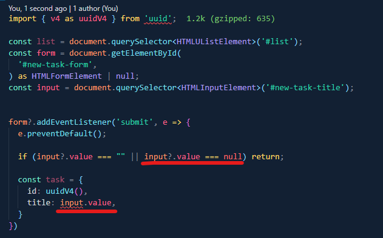

# This is a starter TypeScript project with snowpack as bundler

### New things learned about TS compiler:

- You can create however many `.ts` files as you want, and, when you run, just `tsc` or `tsc --watch`, Typescript will create corresponding `.js` files for all the `.ts` files and it will create them inside the folders where the `.ts` files reside
- But if you want TS to output the `.js` files into a particular folder, you need to go inside `tsconfig.json` and change the value of `"outDir"` as `the path to your folder`, like this: `"outDir": "./path-to-the-folder"`

### Limitation of using different npm packages without a bundler

- Browsers do not (probably!) have a way to read scripts from `node_modules` folder, so, you need a bundler to bundle the scripts that browsers can read

- So, for this project, we are gonna use `snowpack` as a bundler

### New things learned about DOM and TS:

- You can use TS code below to find an HTML element. Note that `document.querySelector<T>()` takes a `generic` as a paramater, like below: (note: the line below is being distorted, so here is the original line `const input = document.querySelector<HTMLInputElement>('#new-task-title');`)

```js
const input = document.querySelector < HTMLInputElement > '#new-task-title';
```

- But not all methods take `generic` as parameter, such as:

```js
const form = document.getElementById(
  '#new-task-form',
) as HTMLFormElement | null;
```

### Issues to resolve later

- When I used `=== (triple equal)` operator in the comparison, the html element is null
- But when I used `== (double equal)` operator in the comparison, the html element is not null strangely!
