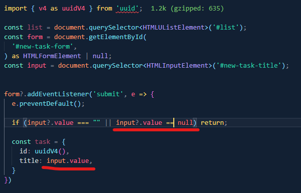

# This is a starter TypeScript project with snowpack as bundler

### New things learned about TS compiler:

- You can create however many `.ts` files as you want, and, when you run, just `tsc` or `tsc --watch`, Typescript will create corresponding `.js` files for all the `.ts` files and it will create them inside the folders where the `.ts` files reside
- But if you want TS to output the `.js` files into a particular folder, you need to go inside `tsconfig.json` and change the value of `"outDir"` as `the path to your folder`, like this: `"outDir": "./path-to-the-folder"`

### Limitation of using different npm packages without a bundler

- Browsers do not (probably!) have a way to read scripts from `node_modules` folder, so, you need a bundler to bundle the scripts that browsers can read

- So, for this project, we are gonna use `snowpack` as a bundler

### New things learned about DOM and TS:

- You can use TS code below to find an HTML element. Note that `document.querySelector<T>()` takes a `generic` as a paramater, like below: (note: the line below is being distorted, so here is the original line `const input = document.querySelector<HTMLInputElement>('#new-task-title');`)

```js
const input = document.querySelector < HTMLInputElement > '#new-task-title';
```

- But not all methods take `generic` as parameter, such as:

```js
const form = document.getElementById(
  'new-task-form',
) as HTMLFormElement | null;
```

### Issues to resolve later

- When I used `=== (triple equal)` operator in the comparison, the html element is null
  
- But when I used `== (double equal)` operator in the comparison, the html element is not null strangely! Am I missing something? 🤔 Need to find out why!
  

### Here is the code for a quick lookup

- code from `index.ts` file

```ts
import { v4 as uuidV4 } from 'uuid';

type Task = {
  id: string;
  title: string;
  completed: boolean;
  createdAt: Date;
};

const list = document.querySelector<HTMLUListElement>('#list');
const form = document.getElementById('new-task-form') as HTMLFormElement | null;
const input = document.querySelector<HTMLInputElement>('#new-task-title');
const tasks: Task[] = loadTasks();
tasks.forEach(addListItem);
console.log(loadTasks());

form?.addEventListener('submit', (e) => {
  e.preventDefault();

  if (input?.value === '' || input?.value == null) return;

  const newTask: Task = {
    id: uuidV4(),
    title: input.value,
    completed: false,
    createdAt: new Date(),
  };

  tasks.push(newTask);
  console.log(tasks);

  addListItem(newTask);
  input.value = '';
});

function addListItem(task: Task) {
  const item = document.createElement('li');
  const label = document.createElement('label');
  const checkbox = document.createElement('input');
  checkbox.addEventListener('change', () => {
    task.completed = checkbox.checked;
    saveTasks();
  });
  saveTasks();
  checkbox.type = 'checkbox';
  checkbox.checked = task.completed;
  label.append(checkbox, task.title);
  item.append(label);
  list?.append(item);
}

function saveTasks() {
  localStorage.setItem('TASKS', JSON.stringify(tasks));
}

function loadTasks(): Task[] {
  const taskJSON = localStorage.getItem('TASKS');
  if (taskJSON == null) return [];
  return JSON.parse(taskJSON);
}
```
